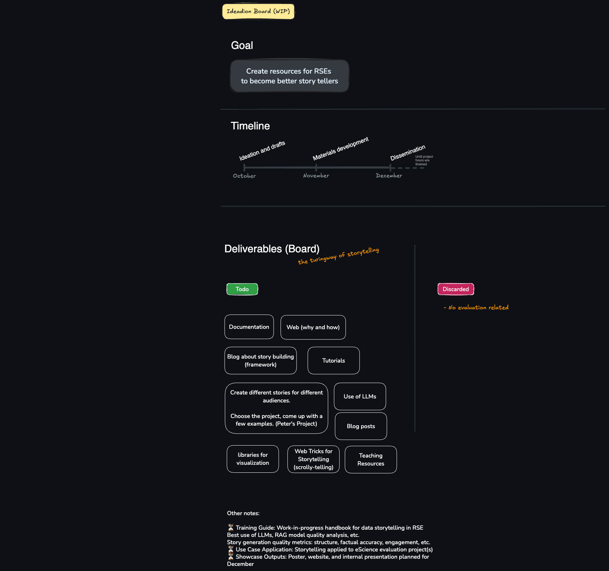

# 📊 Data Storytelling @ eScience Center

Welcome to the repository for our **Tech Focus Project 2025: Data Storytelling**, part of the NLeSC initiative to enhance communication and accessibility of research software through compelling, AI-powered narratives.

This repository gathers all deliverables, research, tools, and demos created during the project.

> 🧠 Goal: Help Research Software Engineers (RSEs) and scientists **present complex research outputs using storytelling techniques**, combining narrative design, data visualization, and AI tooling.

---

### Ideation board



(You can edit this board with the [Excalidraw plugin for VSCode](https://marketplace.visualstudio.com/items?itemName=pomdtr.excalidraw-editor))

---

## 🌟 Project Highlights (Deliverables & Milestones)

Below is the planned list of project deliverables, based on the proposal and current progress. We aim to complete these by December 2025 unless noted otherwise (In progress...).

- ✅ Literature Review: Systematic overview of data storytelling across domains
- ✅ Working AI Pipelines: Modular storytelling pipeline using small LLMs
- ⏳ Training Guide: Work-in-progress handbook for data storytelling in RSE
  - Best use of LLMs, RAG model quality analysis, etc.
  - Story generation quality metrics: structure, factual accuracy, engagement, etc.
- ⏳ Use Case Application: Storytelling applied to eScience evaluation project(s)
- ⏳ Showcase Outputs: Poster, website, and internal presentation planned for December


## 📚 Awesome Resources

### 🧾 Core Documents
- 📘 Student Literature Review (2025) — Theoretical background across journalism, finance, education, and medicine
- 📙 MSc Thesis: Educational Data Storytelling with SLMs (Ye, 2025) — Modular AI pipeline using RAG + SLMs
- 📝 Project Proposal (TFP25) — Official eScience Center project definition


## 🗂️ Project Structure

```text
📁 /docs           → Literature review, thesis, and guidelines
📁 /training       → Training materials for RSEs
📁 /examples       → Use cases and storytelling demos
📁 /tools          → Prompt templates, workflows, and helper scripts
📁 /slides         → Presentation materials for internal sharing
📁 /poster         → Visual assets for eScience Center showcase
```

### 👥 Team

- Kody Moodley - Research Software Engineer
- [Pablo Rodríguez](https://github.com/PabRod)	- Research Software EngineerResearch Software Engineer
- Stefan Verhoeven - Research Software Engineer
- Peter Kalverla - Research Software Engineer
- Jesse Gonzalez - Project Lead - Research Software Engineer  


- Adam Belloum - Tech Lead
- Junming Ye - Student Researcher

⸻

🔗 Contributing

This repository is for internal use at the eScience Center. However, if you’re interested in contributing examples, feedback, or tools, please contact the team.

---

🚀 Let’s make scientific data accessible, impactful, and memorable through better storytelling.
`