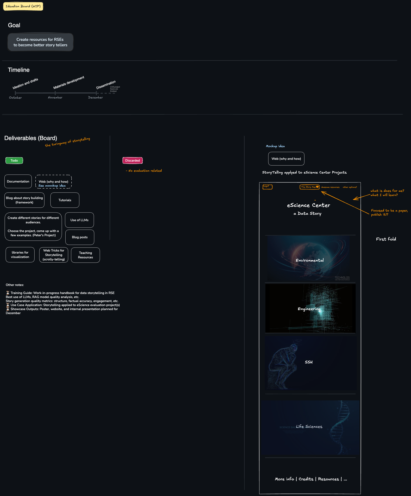

# Data Storytelling @ eScience Center

[](https://opensource.org/licenses/Apache-2.0)
[](https://research-software-directory.org/projects/data-storytelling)
[](https://doi.org/10.5281/zenodo.17854133)

Welcome to the repository for our **Tech Focus Project 2025: Data Storytelling**, part of the NLeSC initiative to enhance communication and accessibility of research software through compelling, AI-powered narratives.

This repository gathers all deliverables, research, tools, and demos created during the project.

> Goal: Help Research Software Engineers (RSEs) and scientists **present complex research outputs using storytelling techniques**, combining narrative design, data visualization, and AI tooling.

---

### Ideation board



(You can edit this board with the [Excalidraw plugin for VSCode](https://marketplace.visualstudio.com/items?itemName=pomdtr.excalidraw-editor))

---

## Project Highlights (Deliverables & Milestones)

Below is the planned list of project deliverables, based on the proposal and current progress. We aim to complete these by December 2025 unless noted otherwise (In progress...).

- ✅ Literature Review: Systematic overview of data storytelling across domains
- ✅ Working AI Pipelines: Modular storytelling pipeline using small LLMs
- ✅ **Interactive Web Application**: 3D visualization platform with AI story generator ([webapp/](./webapp/))
- Training Guide: Work-in-progress handbook for data storytelling in RSE
  - Best use of LLMs, RAG model quality analysis, etc.
  - Story generation quality metrics: structure, factual accuracy, engagement, etc.
- Use Case Application: Storytelling applied to eScience evaluation project(s)
- Showcase Outputs: Poster, website, and internal presentation planned for December

---

## Web Application

The [`webapp/`](./webapp/) directory contains an interactive 3D visualization platform for exploring eScience Center research software projects.

### Key Features

- **3D Domain Exploration**: Navigate through four research domains (Life Sciences, Environment, Social Sciences, Engineering) with unique 3D visualizations
- **AI Story Generator**: Generate audience-specific narratives using Google Gemini:
  - Communications (general public)
  - Academic (scholarly)
  - Internal Review (leadership)
  - One Pager (executive summary)
- **Context Enrichment**: Include related software and uploaded documents for richer stories
- **Export Options**: Download stories as Markdown or PDF

See the [webapp README](./webapp/README.md) for setup and usage instructions.


## Awesome Resources

### 🧾 Core Documents
- Student Literature Review (2025) — Theoretical background across journalism, finance, education, and medicine
- MSc Thesis: Educational Data Storytelling with SLMs (Ye, 2025) — Modular AI pipeline using RAG + SLMs
- Project Proposal (TFP25) — Official eScience Center project definition


## Project Structure

```text
📁 /docs           → Literature review, thesis, and guidelines
📁 /training       → Training materials for RSEs
📁 /examples       → Use cases and storytelling demos
📁 /tools          → Prompt templates, workflows, and helper scripts
📁 /slides         → Presentation materials for internal sharing
📁 /poster         → Visual assets for eScience Center showcase
```

See also:

📁 [sharepoint](https://nlesc.sharepoint.com/sites/all/Shared%20Documents/Forms/AllItems.aspx?CT=1759496178615&OR=OWA%2DNT%2DMail&CID=ec1b06c4%2Dfca1%2D9f15%2D76d3%2D4f178df059fb&id=%2Fsites%2Fall%2FShared%20Documents%2FProjectportfolio%2FProjects%2F27025T01%20TFP25%20Story%20Telling&sortField=Modified&isAscending=false&viewid=8c7214e3%2Ddfc5%2D4ffa%2Dac92%2D421aab48d30f&p=true&ct=1752486265370&or=OWA%2DNT%2DMail&cid=d3bcbc02%2D2e50%2Df150%2De44d%2D4047d80d23ed&ga=1) (Requires login, members only)

### Team

- Kody Moodley - Research Software Engineer
- [Pablo Rodríguez](https://github.com/PabRod)	- Research Software Engineer
- Stefan Verhoeven - Research Software Engineer
- Peter Kalverla - Research Software Engineer
- [Jesse Gonzalez](https://github.com/ctwhome) - Project Lead - Research Software Engineer
- Adam Belloum - Tech Lead
- Junming Ye - Student Researcher

⸻

Contributing

This repository is for internal use at the eScience Center. However, if you’re interested in contributing examples, feedback, or tools, please contact the team.

---

🚀 Let’s make scientific data accessible, impactful, and memorable through better storytelling.
