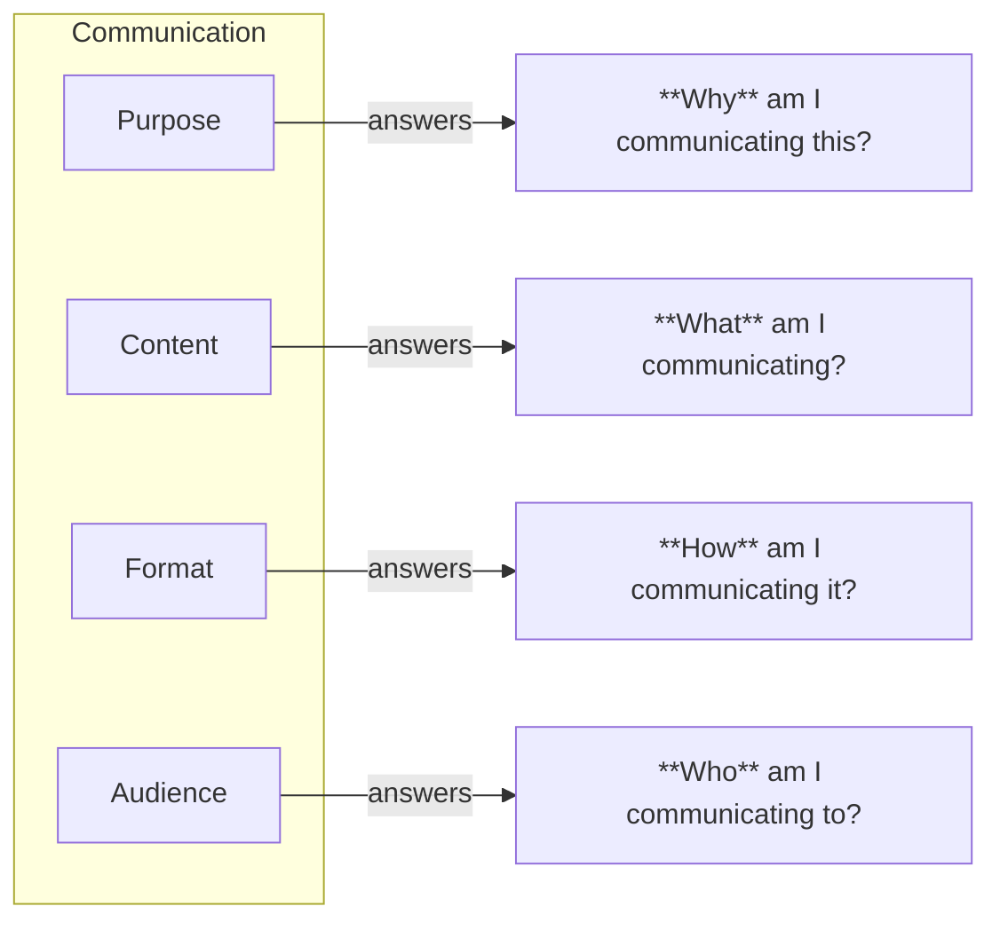

# On purpose, content, format and audience
Any communication piece has a purpose, a content, a format and an audience.
Each of them answers a very crucial question:

Let's illustrate this by dissecting some of the classical communication genres:

- An elevator pitch
    - Purpose: raise interest in your ideas
    - Content: just two or three carefully selected highlights
    - Format: oral, and extremely short
    - Audience: usually one or two persons, not necessarily interested in what you have to tell
- A scientific seminar in a congress
    - Purpose: plant the seeds of new ideas[^1]
    - Content: brief description of research ideas
    - Format: oral, and short
    - Audience: experts in the field or in similar fields
- A science communication talk
    - Purpose: raise curiosity, make the audience enjoy
    - Content: a storyline based on a carefully selected topic
    - Format: mostly oral, rarely allowing for questions
    - Audience: a group of completely different people
- A master class
    - Purpose: make your audience proficient
    - Content: established knowledge
    - Format: mostly oral, in a classroom, allowing for questions. Extended over a semester
    - Audience: students with no previous knowledge of the topic
- A scientific publication
    - Purpose: share state-of-the-art knowledge
    - Content: detailed description of the performed research
    - Format: written, subject to strict styling rules
    - Audience: experts in the field

## Alignment
Let's perform a mental experiment.
Randomly mix purpose, content, format and audience from the examples above.
One possible result would be:

- Purpose: make your audience proficient
- Content: description of the performed research
- Format: oral, and short
- Audience: students with no previous knowledge of the topic

How do you think this will work?
Does it look possible to fulfill the purpose using that format and for that audience?
Something is off.
Purpose, content, format and audience are not aligned.

Misalignment of these elements is one of the most common reasons for bad communication.
Actually, I invite you to apply this mental model to any communication event (talks, lessons, even emails!) that called your attention, either for good or for bad.
It's very illuminating.

## Examples of misaligned communication
We can even build some other classic "genres", in this case examples of bad communication, by randomly sticking together some of the pieces above. Let's start with our previous combination, that we can identify as:

- A talk trying to cover too much
    - Purpose: make your audience proficient
    - Content: detailed description of the performed research
    - Format: oral, and short
    - Audience: students with no previous knowledge of the topic

We can build more familiar genres:

- Your uncle asks you about your PhD thesis, then he regrets
    - Purpose: share state-of-the-art knowledge
    - Content: detailed description of the performed research
    - Format: oral, and extremely short
    - Audience: usually one or two persons, not necessarily interested in what you have to tell
- Last time they invite you to a science communication conference
    - Purpose: share state-of-the-art knowledge
    - Content: detailed description of the performed research
    - Format: mostly oral, rarely allowing for questions
    - Audience: a group of completely different people
- An unattractive pitch
    - Purpose: raise interest in your ideas
    - Content: detailed description of the performed research
    - Format: written, subject to strict styling rules
    - Audience: usually one or two persons, not necessarily interested in what you have to tell

## Take home message
Always keep your purpose, content, format and audience aligned.
Remember: the why, the what, the how and the who.

[^1]: This is more than a poetic metaphor. After all, that's the literal meaning of the word _seminar_ (from latin _seminarium_: plant nursery).