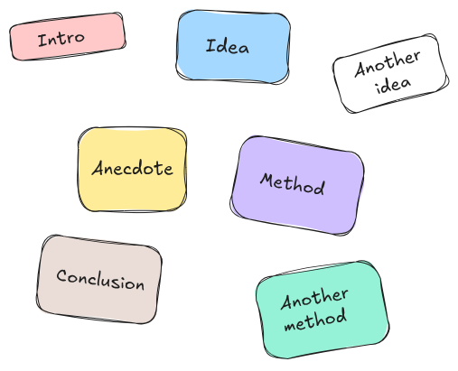

# The story map, a framework for story-building

We are all natural-born storytellers.
Or at the very least, storylisteners.
The same drive lies behind a gathering around the fireplace, a night at the movies or listening to a podcast on your morning run: our brain's hunger for narratives.
We are (almost literally) wired for it.

And yet creating a story can be challenging.

This tutorial presents a strategy for simplifying the creative process of building a story.

And as in any good story, we have to start... from the beginning.

## What is a story?

If you ever experienced the so-called _"blank page syndrome"_, chances are that it originated not from a lack of ideas to write about, but from an overwhelming, chaotic pile of them.

A story, any story, is linear.
It doesn't matter if it is a text, a speech, a movie or even a scientific publication: it will progress from a beginning to an end.

> More specifically, any story will be **consumed** on a linear way.
> Even a story which content is structured in a non-chronological order has a beginning and an end.

And here comes the challenge: our thoughts are rarely that linear.
Most people entertain multiple thoughts simultaneously, or quickly switch from one to the other.
It takes a conscious effort to order them into a coherent narrative.

## Embracing chaos
Instead of getting frustrated about the chaotic nature of our thoughts, let's just embrace it.
Our thoughts are fine just how they are.

Of course, it is not that practical to have our working memory juggling them all.
So let's free our memory and outsource them to... a piece of paper!

Just write them down.
My advice is to do it like in the figure below, in small squares, with no pre-defined order.
Just drop them around as if they were LEGO bricks.

## Structuring your thoughts: the building blocks

The challenge is set!
Our goal is to build something with these bricks.
But first we have to see our bricks, identify them, make sure we're not missing any.
Almost _feel_ them.

Take a moment to look at your building blocks.
Very likely, you'll notice some of them are related.
This relationship can be logical, narrative, chronological, ...

Draw a line between them if that's the case (I suggest using solid lines for solid links, and dashed lines for slightly more subtle links).
We are starting to have **some** structure!
We are slowly creating order out of chaos!

At this stage, you might realize some building blocks are missing.
When that's the case, just add them.
You might also notice some building blocks are redundant.
Well, just merge those together.
You might even judge some of the blocks to be unnecessary.
Drop those without hesitation!
Nothing creates more order out of chaos than reducing the amount of moving parts!

FIGURE HERE

## Navigating your thoughts: the story map

## References
- [Así nace una charla Naukas](https://naukas.com/2023/10/11/asi-nace-una-charla-naukas/)